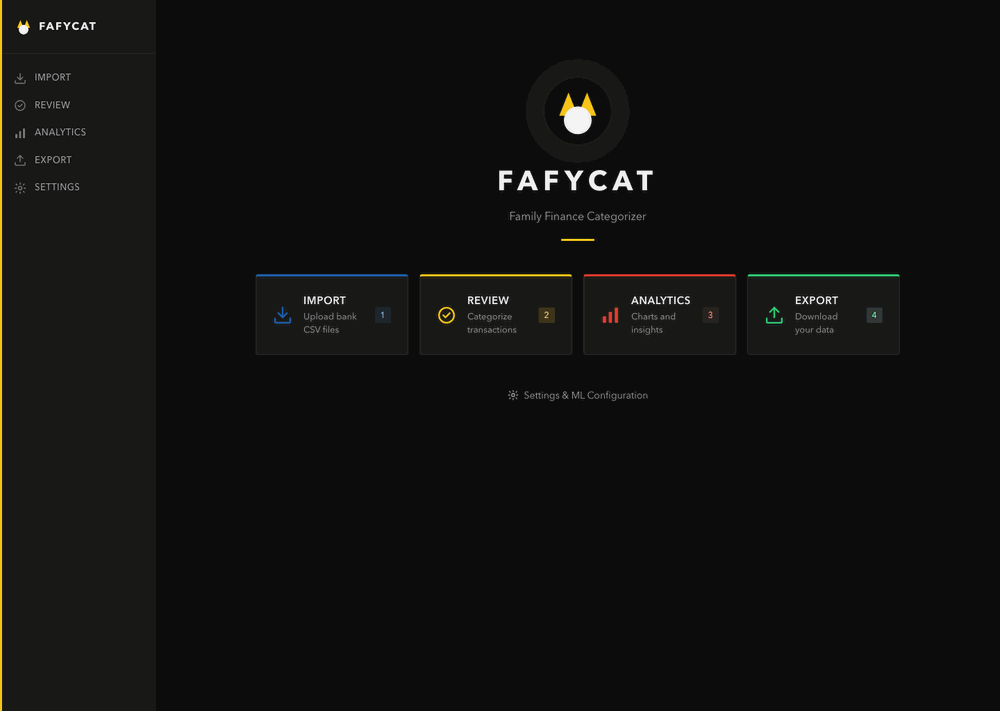
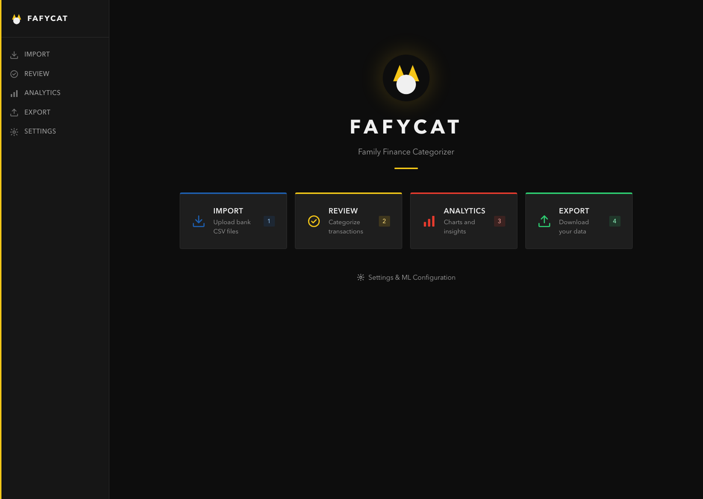
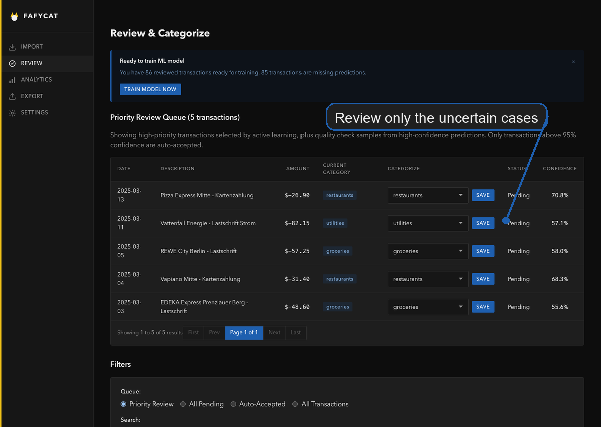
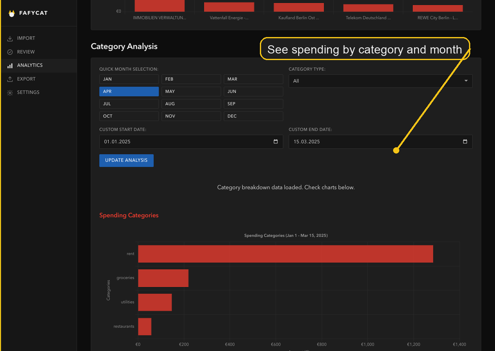

# 🐱 FafyCat - Local-First Transaction Categorization

FafyCat is a privacy-focused financial transaction categorization tool that uses machine learning to automatically organize your banking data with >90% accuracy. All processing happens locally on your device - no cloud services, no data sharing.

<p align="center">
  
</p>

<p align="center">
  <em>Import bank CSVs, let the local model predict categories, review the uncertain cases, and explore the results.</em>
</p>

<p align="center">
  
  
  
</p>

## ✨ Key Features

- **🤖 Smart Categorization**: Machine learning automatically categorizes transactions with high accuracy
- **🔒 Privacy First**: All data stays on your device - no external APIs or cloud services
- **📊 Intelligent Review**: Active learning reduces manual work by 70-90%
- **🏪 Merchant Memory**: Learns from your patterns to improve over time
- **📈 Export Ready**: Multiple export formats for your favorite analysis tools
- **⚡ Fast & Efficient**: Process thousands of transactions in seconds

## 🚀 Quick Start

### Prerequisites

- Python 3.13 or later
- uv package manager https://docs.astral.sh/uv/getting-started/installation/

### Installation

1. **Install with uv**
   ```bash
   uv tool install git+https://github.com/davidchris/fafycat
   ```

2. **Or clone for development**
   ```bash
   git clone https://github.com/davidchris/fafycat.git
   cd fafycat
   uv sync
   ```

3. **Configure environment** (optional)
   ```bash
   cp .env.example .env
   # Edit .env only if you want to override the defaults
   ```

4. **Start the application**
   ```bash
   # Start the packaged app
   fafycat serve

   # Development mode with sample data and hot reload
   fafycat serve --dev

   # If developing from a cloned checkout
   uv run fafycat serve --dev
   ```

5. **Open your browser**
   - Development: http://localhost:8001
   - Production: http://localhost:8000

## 📋 Getting Started Guide

### First Time Setup

1. **Import Your Data**
   - Navigate to the Import page
   - Upload your bank transaction CSV files
   - The system auto-detects column formats

2. **Review & Categorize**
   - Go to the Review page
   - Correct any miscategorized transactions
   - The system learns from your corrections

3. **Train the Model**
   - Visit Settings → Train Model
   - Click "Train ML Model Now"
   - Training takes seconds to minutes

4. **Enjoy Automation**
   - Future imports will be auto-categorized
   - Only review uncertain predictions
   - Export data for analysis

### Using Labeled Historical Data

If you have previously categorized transactions:

```bash
# Import your labeled data
uv run python scripts/import_labeled_data.py --data-path /path/to/your/data

# Or use the reset script for a fresh start
uv run python scripts/reset_and_import.py --labeled-data-path /path/to/your/data --train-model
```

#### Where do I get my banking transactions from?

- I'm getting mine via the [MoneyMoney App](https://moneymoney.app).

## 🏗️ Architecture

```
┌─────────────────┐
│   CSV Import    │ → Flexible format detection
└────────┬────────┘
         │
         ▼
┌─────────────────┐     ┌──────────────────┐
│ Feature Extract │────▶│  ML Prediction   │
│  - Merchants    │     │  - LightGBM      │
│  - Amounts      │     │  - Naive Bayes   │
│  - Patterns     │     │  - Ensemble      │
└─────────────────┘     └──────────────────┘
                                 │
                                 ▼
                        ┌──────────────────┐
                        │   Review UI      │
                        │  Active Learning │
                        └──────────────────┘
                                 │
                                 ▼
                        ┌──────────────────┐
                        │   Data Export    │
                        │ CSV/Excel/JSON   │
                        └──────────────────┘
```

## 📊 Supported CSV Formats

FafyCat automatically detects and handles various banking export formats:

- **Date**: Various formats (DD/MM/YYYY, MM/DD/YYYY, YYYY-MM-DD)
- **Amount**: Positive/negative or separate debit/credit columns
- **Description**: Transaction details and merchant names
- **Category**: If present, used for training

Common bank formats supported:
- German banks (Sparkasse, DKB, etc.)
- US banks (Chase, Bank of America, etc.)
- UK banks (Barclays, HSBC, etc.)
- Generic CSV exports

## 🎯 How It Works

### Smart Learning System

1. **Initial Training**: Learn from your categorized transactions
2. **Prediction**: Automatically categorize new transactions
3. **Active Learning**: Intelligently select which transactions need review
4. **Continuous Improvement**: Learn from corrections over time

### Privacy & Security

- **Local Processing**: All ML models run on your device
- **No Cloud Services**: Zero external API calls
- **Your Data**: You own and control all your financial data
- **Open Source**: Fully auditable codebase

## 🛠️ Configuration

### Environment Variables

Create a `.env` file only if you want to override the default user-data location:

```bash
# Data defaults to your platform user-data directory
# Override only if you want a custom location
FAFYCAT_DATA_DIR=/path/to/fafycat-data
FAFYCAT_EXPORT_DIR=/path/to/fafycat-data/exports
FAFYCAT_MODEL_DIR=/path/to/fafycat-data/models

# Optional explicit database override
FAFYCAT_DB_URL=sqlite:////path/to/fafycat-data/fafycat.db

# Server settings
FAFYCAT_DEV_PORT=8001
FAFYCAT_PROD_PORT=8000
FAFYCAT_HOST=127.0.0.1
```

### Database Management

- **Default**: Uses your platform user-data directory
- **Development**: `fafycat serve --dev` seeds synthetic test data
- **Custom**: Set `FAFYCAT_DB_URL` or pass `--data-dir`

## 📈 Performance

- **Accuracy**: >90% correct categorization
- **Speed**: <100ms per transaction
- **Scale**: Handles 100,000+ transactions
- **Efficiency**: 70-90% reduction in manual review

## 🔧 Development

### Running Tests
```bash
uv run pytest
```

### Code Quality
```bash
# Linting
uvx ruff check --fix

# Formatting
uvx ruff format

# Type checking
uvx ty check
```

### API Documentation
- FastAPI docs: http://localhost:8000/docs
- OpenAPI schema: http://localhost:8000/openapi.json

## 📦 Project Layout

All shipped application code lives under `src/fafycat/`:

- `src/fafycat/app.py` for the FastAPI app factory
- `src/fafycat/cli.py` for the packaged CLI
- `src/fafycat/api/` for API routes and services
- `src/fafycat/web/` for HTML routes, pages, and components
- `src/fafycat/core/` for config, database, and shared models
- `src/fafycat/data/` for CSV processing
- `src/fafycat/ml/` for the ML pipeline
- `src/fafycat/static/` for packaged static assets

## 🤝 Contributing

tbd.

## 📄 License

This project is licensed under the Apache License 2.0 - see the [LICENSE](LICENSE) file for details.

## 🙏 Acknowledgments

- Built with FastAPI, FastHTML, and scikit-learn
- Inspired by the need for privacy-preserving financial tools

---

**Note**: FafyCat is designed for personal use. Always verify categorizations for important financial decisions.
